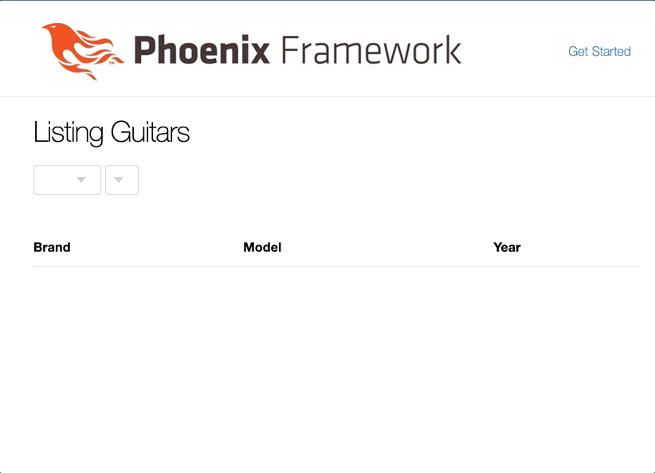

# Instrument Store 

This is a demo LiveView app which illustrates a second dropdown that's dynamically populated according to the value of the first dropdown.

To start your Phoenix server:

  * Install dependencies with `mix deps.get`
  * Create and migrate your database with `mix ecto.setup`
  * Run seeds with `mix run priv/repo/seeds.exs`
  * Start Phoenix endpoint with `iex -S mix`

Now you can visit [`localhost:4000`](http://localhost:4000) from your browser.

